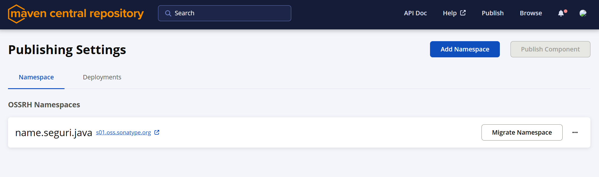
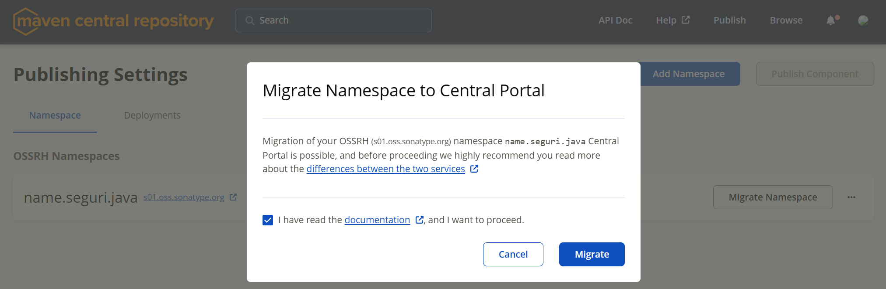
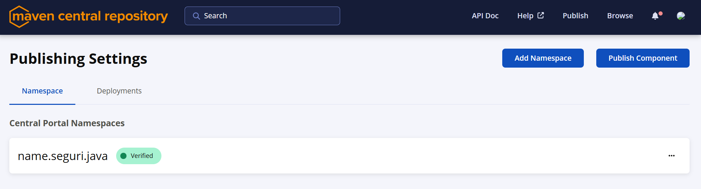

Today I've decided to release a new version of [springpom](https://github.com/seguri/springpom).
Last time I published a version there was the old OSSRH, but now I have to migrate to the new Central Portal.

This required:

- migrating from `nexus-staging-maven-plugin` to `central-publishing-maven-plugin`
- migrating my `name.seguri.java` namespace from legacy OSSRH to Central Portal

For the first part, I've replaced:

```xml
<build>
  <plugins>
    <plugin>
      <groupId>org.sonatype.plugins</groupId>
      <artifactId>nexus-staging-maven-plugin</artifactId>
      <version>${dep.plugin.nexus.version}</version>
      <extensions>true</extensions>
      <configuration>
        <serverId>ossrh</serverId>
        <nexusUrl>https://s01.oss.sonatype.org/</nexusUrl>
        <autoReleaseAfterClose>true</autoReleaseAfterClose>
      </configuration>
    </plugin>
  </plugins>
</build>
```

with:

```xml
<build>
  <plugins>
    <plugin>
      <groupId>org.sonatype.central</groupId>
      <artifactId>central-publishing-maven-plugin</artifactId>
      <version>${dep.plugin.central.version}</version>
      <extensions>true</extensions>
      <configuration>
        <publishingServerId>central</publishingServerId>
        <!-- Keep 'false' for manual release process in Central Portal UI, 'true' to attempt automatic release -->
        <autoPublish>false</autoPublish>
      </configuration>
    </plugin>
  </plugins>
</build>
```

For the second part, go to your [namespaces](https://central.sonatype.com/publishing/namespaces) and click "Migrate Namespace":



Confirm the migration:



After a few minutes, you should see your namespace as verified in the Central Portal:


