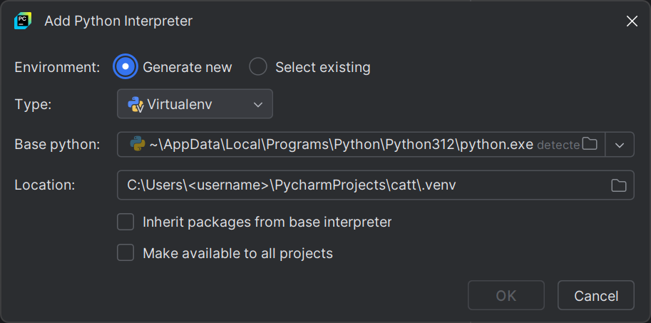

I was trying to see if I could stream content from my laptop to my Android TV using [catt](https://github.com/skorokithakis/catt), so I decided to clone its repo.
I saw that the project was using [Poetry](https://python-poetry.org/) for dependency management and I decided to give it a try.

I've not directly installed Python on any of my Windows machines; I prefer to use JetBrains [PyCharm](https://www.jetbrains.com/pycharm/) for Python development and let it manage my Python interpreters.
The first step is then to find out which Python interpreter is being used by PyCharm.
I opened one of my Python projects in PyCharm and started to add a new interpreter:



Python 3.12 is inside `~\AppData\Local\Programs\Python\Python312\`.
I `cd` into that folder and run:

```
.\python.exe -m pip install --user pipx
.\python.exe -m pipx ensurepath
```

`pipx` is now installed and added to my path. I can now install Poetry:

```
pipx install poetry
```

So where is Poetry installed? I can find it out by running:

```
> pipx list
venvs are in C:\Users\<username>\pipx\venvs
apps are exposed on your $PATH at C:\Users\<username>\.local\bin
manual pages are exposed at C:\Users\<username>\.local\share\man
   package poetry 2.0.1, installed using Python 3.12.2
    - poetry.exe
```

The first line tells me where the virtual environments are stored.
Poetry's one is in `~\pipx\venvs\poetry` and the executable is in `~\.local\bin\poetry.exe`.