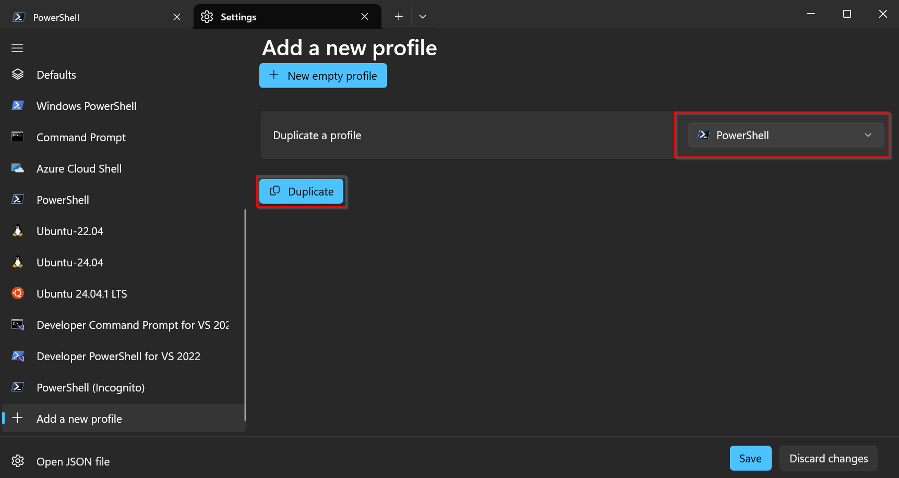
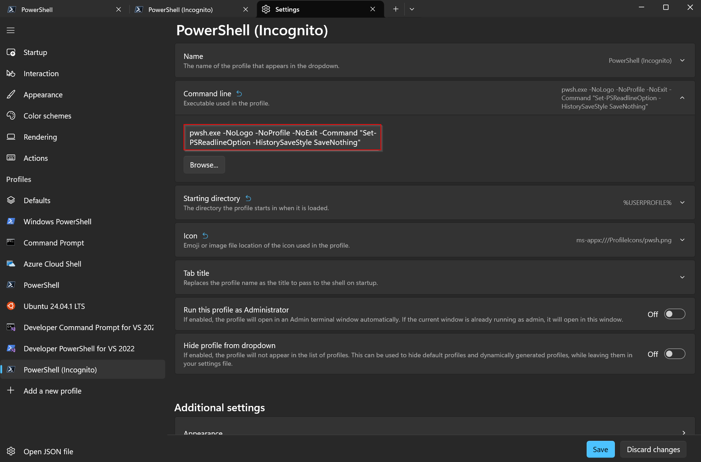
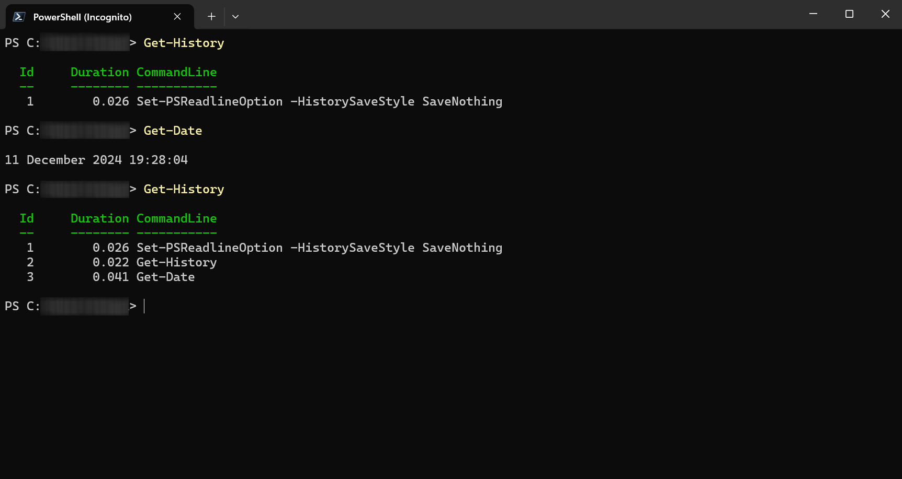

Do you need to run a command in a new PowerShell session without leaving any trace, or without showing any previous commands when navigating the history with the arrow keys?
Open the Terminal, open the Settings menu, scroll down to the Profiles section, and click on the "Add profile" button.
Duplicate the PowerShell profile:



I've called mine "PowerShell (Incognito)". Then set the following in the "Command line" field:

```
pwsh.exe -NoLogo -NoProfile -NoExit -Command "Set-PSReadlineOption -HistorySaveStyle SaveNothing"
```



This is how a new PowerShell Incognito session looks like:

