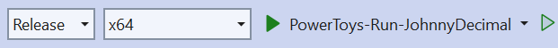
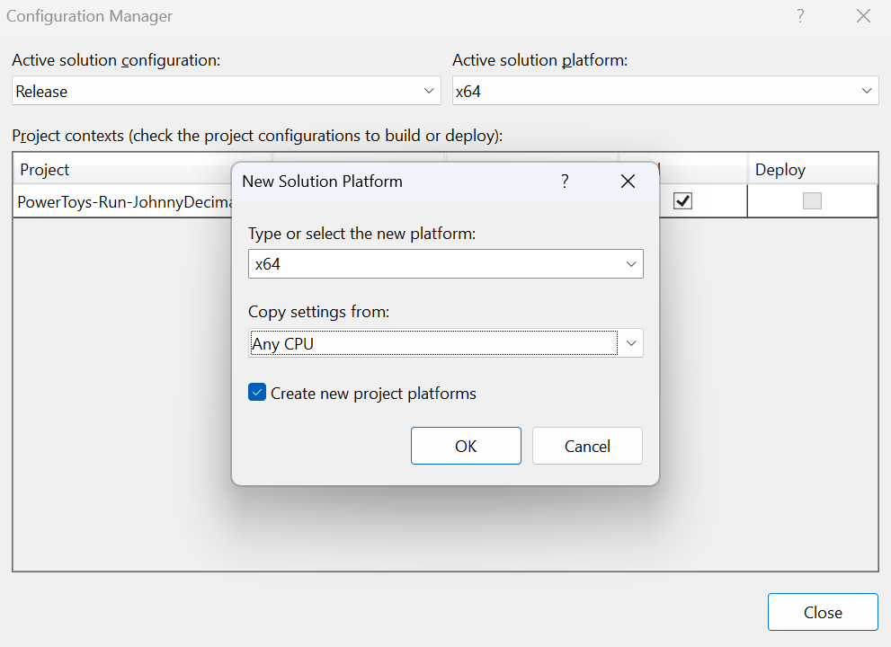
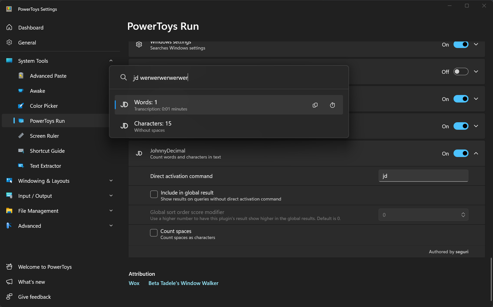
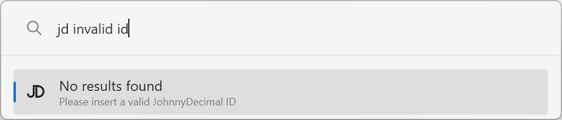
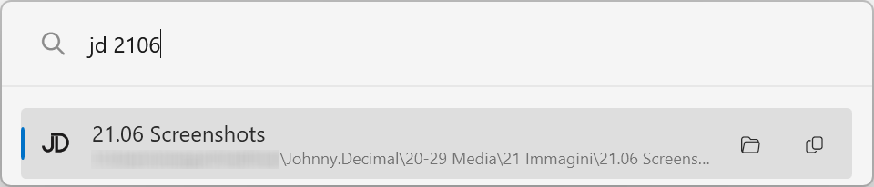
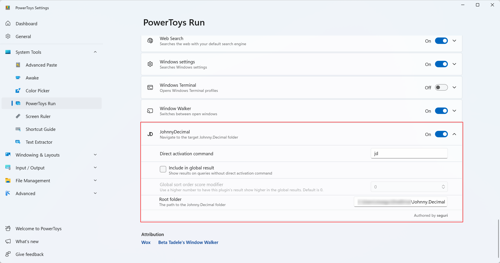

I started a few years ago to organize my digital stuff with the [Johnny.Decimal](https://johnnydecimal.com/) system.
On macOS I had a custom Raycast script to quickly tap into my Johnny.Decimal folders; now that I'm on Windows, I want to replicate that functionality with [PowerToys Run](https://learn.microsoft.com/en-us/windows/powertoys/run).

## Inspiration

There are some excellent resources to get started with PowerToys Run plugins:

- [Tutorial by Henrik Lau Eriksson](https://conductofcode.io/post/creating-custom-powertoys-run-plugins/)
- [Existing plugins](https://github.com/microsoft/PowerToys/blob/main/doc/thirdPartyRunPlugins.md)
- [New plugin checklist](https://github.com/microsoft/PowerToys/blob/main/doc/devdocs/modules/launcher/new-plugin-checklist.md)

I'll document my journey here, with step-by-step commits in my [repo](https://github.com/seguri/powertoys-run-johnnydecimal).
When you see a link called "milestone", you can check out how my code looked up to that point.
Let's get started!

## Project setup

Download and install [Visual Studio 2022](https://visualstudio.microsoft.com/downloads/).

Create a new C# Class Library project with the name `Community.PowerToys.Run.Plugin.JohnnyDecimal`.
Import Henrik's code. ([milestone](https://github.com/seguri/PowerToys-Run-JohnnyDecimal/tree/666c79a0a596b37e6c168472f6543b167a2da886))

Set your own unique ID, name and logo.
Make sure that `ExecuteFileName` from `plugin.json` corresponds to your project name. ([milestone](https://github.com/seguri/PowerToys-Run-JohnnyDecimal/tree/9f7741b3e95b8bd1e4e8b3b4b4ec0739d486c97b))

> **About the logo**:
> I used a 64x64 PNG file that I initially named `icon-64.dark.png`. I've later removed the `-64` part because it was causing the icon to be ignored and added an `-930` to the original fullsize images instead.

## First run

Let's run the plugin. We changed the activation command and the logo, but the original functionality that counts words and characters is still there.

This is the first time I run a project in Visual Studio 2022, so some of the next steps might be unnecessary for you.

I set the Solution Configuration to "Release" and the Solution Platform to "x64":

As I had no "x64" option, I had to add it. Open Build > Configuration Manager and copy the following settings:

These changes modify the `.sln` file, so here's a very small [milestone](https://github.com/seguri/PowerToys-Run-JohnnyDecimal/tree/0076457e11f42815f7a6d69888629b255e5128c6).

Build the project with Build > Build Solution or Ctrl+Shift+B.
My build is located in `\bin\x64\Release\net8.0-windows\Community.PowerToys.Run.Plugin.JohnnyDecimal.dll`.
I copied the parent folder `\bin\x64\Release\net8.0-windows` as `%LOCALAPPDATA%\Microsoft\PowerToys\PowerToys Run\Plugins\JohnnyDecimal\` and manually restarted Power Toys:

If you have [`just`](https://github.com/casey/just) installed, you can use the provided `Justfile` to copy the plugin to the PowerToys Run Plugins folder with `just copy`. ([milestone](https://github.com/seguri/PowerToys-Run-JohnnyDecimal/tree/a047e70819fad8e2664dcf4ef82676c685cf70d5))

## Plugin configuration

The user must be able to configure the plugin to set the root folder of their Johnny.Decimal system.
This can be done by adding a new option to the `AdditionalOptions` function.
I'll leave the existing option for now and clean all code related to counting words and characters later. ([milestone](https://github.com/seguri/PowerToys-Run-JohnnyDecimal/tree/87324b54c53161a177af78144ce51f90563427e5))

## Main Logic

This is the most challenging part of the project, as I need to:

- Parse user input in search of a valid Johnny.Decimal unique id
- Present the folder that matches the unique id
- Associate an "Open" action with the selected folder

The first step is easy.
I'll add a new class `JohnnyDecimalId` with a static method `TryParse` that returns a `JohnnyDecimal` object that knows the area, category, and id:

The second step is the core of the plugin.
I've read that with I/O operations, the plugin should implement the `IDelayedExecutionPlugin` interface, but the plugin failed to load when I did that, so I'll stick with `IPlugin` for now.
I'll search for a folder matching the unique id and eventually add it to the query results.
Rather than listing all subfolders recursively, I'll proceed folder by folder, as I don't want to slow down the search: area, category, and finally id.

Finally, I'll add the "Open" and "Copy" actions to the selected folder. ([milestone](https://github.com/seguri/PowerToys-Run-JohnnyDecimal/tree/f4c1f53d612acb030f5854d0de5cafc17011c334))

## Clean up

I'll remove all code related to counting words and characters and any other unnecessary code. ([milestone](https://github.com/seguri/PowerToys-Run-JohnnyDecimal/tree/e85bb5f1c5f6d40ac88a4045f2fb933768662103))

## Conclusion

I'm excited to have my first PowerToys Run plugin up and running!
You can find the first release [here](https://github.com/seguri/PowerToys-Run-JohnnyDecimal/releases/tag/1.0.1).
To install it, download the zip file and extract it to `%LOCALAPPDATA%\Microsoft\PowerToys\PowerToys Run\Plugins\`, restart PowerToys and configure the root folder of your Johnny.Decimal system.

