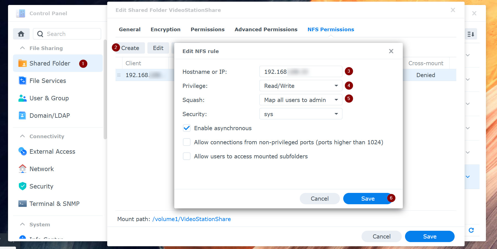
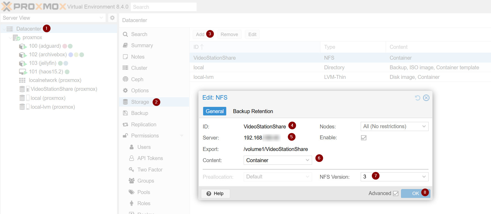

This will be another post you'll find on the subject, but getting this right seems to be quite hard.

- [Here's part of the official documentation](https://pve.proxmox.com/wiki/Unprivileged_LXC_containers#Using_local_directory_bind_mount_points)
- [And people that found unofficial solutions](https://forum.proxmox.com/threads/tutorial-unprivileged-lxcs-mount-cifs-shares.101795/)

What's the initial context and the problem we want to solve?
You've installed proxmox on a home server and then many containers including jellyfin, and you have a Synology NAS full of content that you want jellyfin to stream.

This would be easy with priviledged containers, where you can directly mount the NFS share.
This approach is discouraged though; the recommended way is to use unpriviledged containers, and jellyfin is by default created like that.

The problem with this type of containers is that they are not authorized to mount an NFS share directly, and users like `root:0:0` who look normal inside the container are in reality being remapped by the proxmox host as `root:100000:100000`.
The LXC team thinks these containers are safe by design because even if you get to escape the container as root, when you land on proxmox you will be just a normal unpriviledged user.

How does this complicate our setup?

1. We need to mount the NFS share as a proxmox mount
2. The owner of the NFS share will be the (first?) synology admin user
3. Share the proxmox mount with the container
4. Exclude the owner (uid and gid) of the NFS share from the remapping `0 -> 100000`

## Share a folder from Synology



Create an NFS shared folder on your Synology NAS:

- Insert the IP of your proxmox server (and not of your jellyfin server).
- Read/Write is mandatory.
- "Map all users to admin" is fundamental to avoid the "nobody/nogroup" permission issue later in the process.

## Mount the NFS shared folder on proxmox



Add the NFS folder as a new datacenter storage:

- The ID you choose will be used as the default folder name under `/mnt/pve/`
- The Server is the IP of your NAS
- Specify the path of the folder you shared
- Choose "Container"
- Choose NFS version 3 (this is the max supported by my NAS at the moment)

You should now see the NFS folder on your proxmox host and you can check which user owns it:

```
root@proxmox:~# ls -ln /mnt/pve/VideoStationShare
drwxrwxrwx 13 1026 100 4096 Apr 23 17:15  Movies
drwxrwxrwx  9 1026 100 4096 Apr 23 16:47  TVShows
```

In my case, my admin user on my Synology NAS has uid=1026 and gid=100.
This will be useful later, when we'll need to make the jellyfin container aware of this user.

## Create a new mountpoint inside the container

This cannot be done via the web interface.
You need to check the proxmox id of your container (103 in my case) and manually edit the container configuration file.
I added the following line to `/etc/pve/lxc/103.conf`:

```
mp0: /mnt/pve/VideoStationShare,mp=/media/VideoStationShare,mountoptions=noatime;nodev;noexec;nosuid,ro=1
```

Now after restarting the container you should see the `/media/VideoStationShare` shared folder, but it will not be accessible:

```
root@proxmox:~# pct stop 103
root@proxmox:~# pct start 103
root@proxmox:~# pct enter 103
root@jellyfin:~# ls -l /media
drwxrwxrwx 12 nobody nogroup 4096 Apr 17 18:15 VideoStationShare/
root@jellyfin:~# ls -ln /media
drwxrwxrwx 12 65534 65534 4096 Apr 17 18:15 VideoStationShare/
```

## Tell jellyfin about user 1026

This part also requires manually editing configuration files on the **proxmox host** (and not the jellyfin container).

First we edit `/etc/subuid` and add the second line:

```
root:100000:65536
root:1026:1
```

Then we edit `/etc/subgid` and add the second line:

```
root:100000:65536
root:100:1
```

We now need to tell proxmox to exclude uid=1026 and gid=100 from the mapping to 100000 and above.

To do this, we edit `/etc/pve/lxc/103.conf` and append the following mappings at the end of the file (remove the comments before saving):

```
lxc.idmap = u 0 100000 1026      # default uid mapping: from 0 to 1026 (excluded)
lxc.idmap = g 0 100000 100       # default gid mapping: from 0 to 100 (excluded)
lxc.idmap = u 1026 1026 1        # custom mapping: 1026 should remain 1026
lxc.idmap = g 100 100 1          # custom mapping: 100 should remain 100
lxc.idmap = u 1027 101026 64509  # default uid mapping: from 1027 till the end
lxc.idmap = g 101 100100 65435   # default gid mapping: from 101 till the end
```

After restarting the container, you should be able to access all folders inside `/media/VideoStationShare`.
