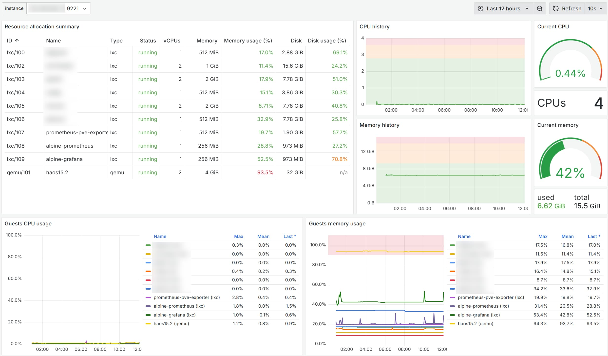

How to setup a nice dashboard like this for your Proxmox host?



For this, we need the components listed down below (along with their IP addresses that I'll use in this article). Everything can be easily installed through [community script](https://community-scripts.github.io/ProxmoxVE/scripts), but I'm expecting that nothing will work out of the box, so I'm documenting my journey here (SPOILER: it was almost flawless).

- proxmox: 192.168.1.10
- prometheus-pve-exporter: 192.168.1.11:9221
- prometheus: 192.168.1.12:9090
- grafana: 192.168.1.13:3000

I started creating a container for the [prometheus-pve-exporter](https://community-scripts.github.io/ProxmoxVE/scripts?id=prometheus-pve-exporter).
After the installation I tried calling `http://192.168.1.11:9221/pve?target=192.168.1.10` and got a 500 error.
The logs show it's just an authentication error.
Let's create a user on the proxmox host with only the necessary permissions to read the metrics:

```
pveum user add prometheus@pve -password "CHANGEME"
pveum acl modify / -user prometheus@pve -role PVEAuditor
```

(The `@pve` part is the default realm, you can verify it with `pveum realm list`.)

Now copy the username and password to `/opt/prometheus-pve-exporter/pve.yml` in the prometheus-pve-exporter container.
`systemctl restart prometheus-pve-exporter` and try calling the endpoint again, you should get all the metrics:

```
# HELP pve_up Node/VM/CT-Status is online/running
# TYPE pve_up gauge
pve_up{id="node/proxmox"} 1.0
```

Let's now install [prometheus](https://community-scripts.github.io/ProxmoxVE/scripts?id=prometheus) (I've chosen the alpine version).

Add the following to `/etc/prometheus/prometheus.yml`:

```yaml
scrape_configs:
  - job_name: 'pve'
    static_configs:
      - targets:
        - 192.168.1.11:9221
    metrics_path: /pve
    params:
      module: [default]
      target: ['192.168.1.10']
      cluster: ['1']
      node: ['1']
```

`rc-service prometheus restart` and verify that the target is up and running at `http://192.168.1.12:9090/targets`.

Now let's install [grafana](https://community-scripts.github.io/ProxmoxVE/scripts?id=grafana) (I've chosen the alpine version).

Go to `http://192.168.1.13:3000/connections/datasources/new` and add a new data source of type `Prometheus`.
Fill in the URL of your prometheus instance and save.

You can head to `http://192.168.1.13:3000/dashboard/import` and paste the URL of [this dashboard](https://grafana.com/grafana/dashboards/10347-proxmox-via-prometheus/) (or even only the id, `10347`) to get started with something created specifically for the prometheus-pve-exporter.

This is it! Now you have a nice grafana dashboard for your proxmox host.